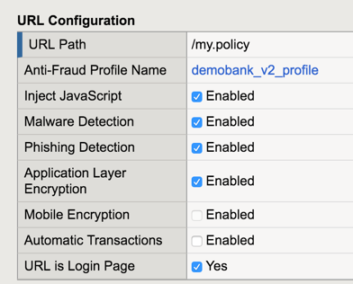
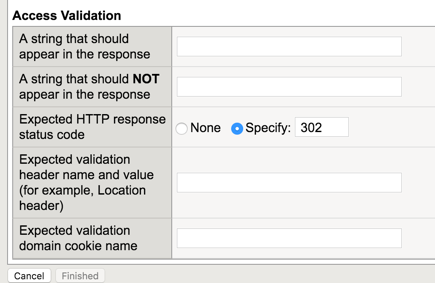
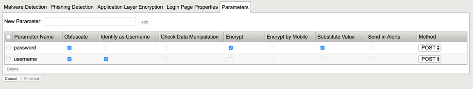

Create front end Virtual Server
===============================

1.	Create a Virtual Server with the right IP address and the right SSL profiles. This VS will handle client connections and negotiate SSL.

2.	Create an FPS profile in order to protect the APM Logon page /my.policy

Don’t forget to fill the Access Validation tab on the Login page properties. 302 HTTP response is OK.

.. warning:: There is a known bug on V13.0. 302 redirection is not detected, so you have to select another method to detect Access Validation. You can use the string "Welcome" to detect Access Validation to the webtop.

Then, add the 2 parameters, and check obfuscation and encryption boxes.

3. Create a VIP2VIP iRule an assign it on the Front end VS. This iRule enables Network Access and App Tunnel support as well.

::

  when HTTP_REQUEST {
    set http_disable 0
    if { [HTTP::uri] starts_with "/isession" or [HTTP::uri] starts_with "/myvpn" } {
          # This is an isession/vpn request, we need to disable http for this request
          log local0. "App Tunnel or Network Access session"
          set http_disable 1
       }
       virtual Layered_VS_FPS
       }

  when HTTP_REQUEST_SEND {
    if { $http_disable != 0 } {
      HTTP::disable
    }
  }
